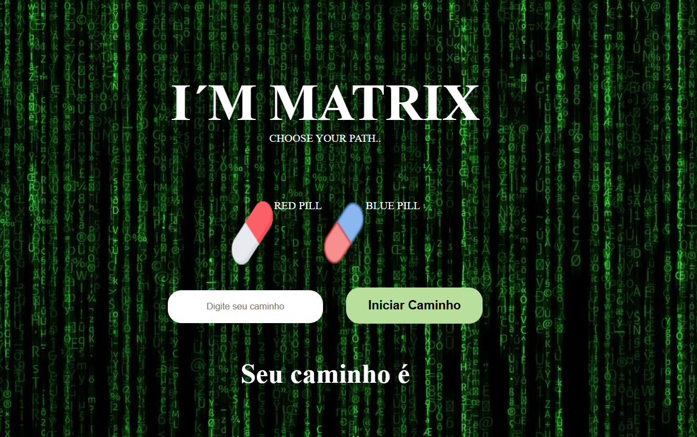

<h1 align="center">MATRIX</h1>

Choose your path

    

## 🧑‍💻 Tecnologia Utilizadas
- HTML
- CSS
- JavaScript
- Git/Github

## Desafio
- Oferecer 2 opções de caminho para o usuário seguir, isto é, o caminho da pílula vermelha e o caminho da pílula azul;
- Utilizar função em js;
- Utitilizar variáveis;
- Utilizar o DOM do js;

## ✍️ Licensa

  

